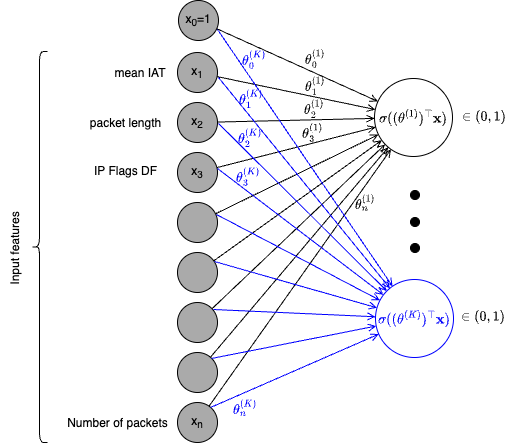

# Network intrusion detection with Softmax Regression
In this laboratory, we will use Softmax Regression to classify the network traffic flows as benign or as one DDoS attack class. The Softmax regression model returns the probability of the input flow of belonging to one of the target classes. We use the argmax operator to decide to which class the flow belongs to (either benign or one DDoS attack classes).
We will train a Softmax regression model on a dataset of benign traffic and DDoS attack traffic.

We will use a dataset of benign and various DDoS attacks from the CIC-DDoS2019 dataset (https://www.unb.ca/cic/datasets/ddos-2019.html).
The network traffic has been previously pre-processed in a way that packets are grouped in bi-directional traffic flows using the 5-tuple (source IP, destination IP, source Port, destination Port, protocol). Each flow is represented with 21 packet-header features computed from max 10 packets:

| Features           | Softmax Regression model           |
|---------------------|--------------------|
| timestamp (mean IAT)    packet_length (mean)   IP_flags_df (sum)   IP_flags_mf (sum)   IP_flags_rb (sum)   IP_frag_off (sum)   protocols (mean)   TCP_length (mean)   TCP_flags_ack (sum)   TCP_flags_cwr (sum)   TCP_flags_ece (sum)   TCP_flags_fin (sum)   TCP_flags_push (sum)   TCP_flags_res (sum)   TCP_flags_reset (sum)   TCP_flags_syn (sum)   TCP_flags_urg (sum)   TCP_window_size (mean)   UDP_length (mean)   ICMP_type (mean)   Packets (counter)  |   |

This folder contains three sample notebooks that show the properties of Logistic and Softmax regression.
The notebook [LogisticRegressionTwoFeatures.ipynb](./LogisticRegressionTwoFeatures.ipynb) shows the different performance of Logistic and Polynomial Logistic regression on synthetic data with linearly and non-linearly separable data.
The notebook [LogisticRegression.ipynb](./LogisticRegression.ipynb) implements a binary network traffic classifier, which classifies the traffic flows as benign or malicious. This notebook can be used to take inspiration for the lab on Softmax Regression provided in the file [SoftmaxRegression.ipynb](./SoftmaxRegression.ipynb), where some parts of the code must be completed to build a model that classifies the traffic flows in multiple traffic classes (one benign and various DDoS attack types).