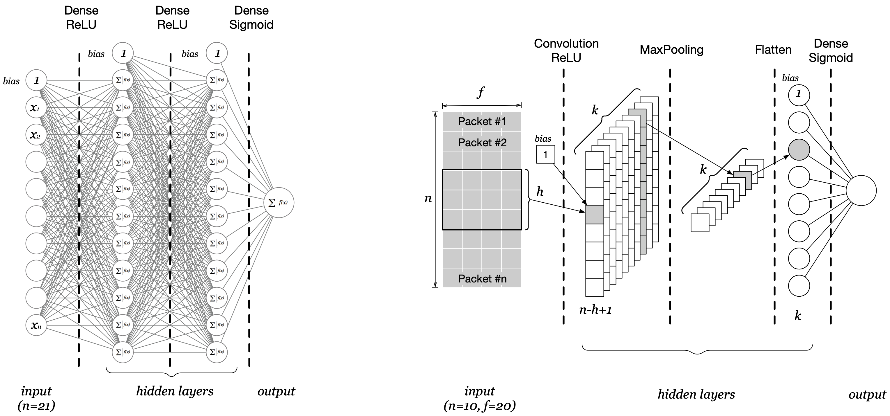

# Adversarial Machine Learning attack against a DL-based NIDS
In this experiment, our primary focus is to assess the robustness of DL-based NIDSs against evasion attacks using AML. Specifically, we evaluate MLP-based and CNN-based NIDSs under two conditions: (1) unperturbed attack and benign network traffic, and (2) manipulated network traffic.

The objective of this study is to analyze how network traffic manipulation impacts the accuracy of the NIDS and to explore how attackers can exploit weaknesses in NIDSs to execute successful attacks.

Both models are designed for binary classification of the network traffic as benign or malicious. Therefore, they return a value between 0 and 1, which is the probability of the input flow of being malicious. 


|   |
|--|
| Sample MLP and CNN architectures|


The laboratory is divided into two phases:
-  **Phase 1**: MLP-based NIDS
    - train a pre-defined MLP model and test it using the test set and an unperturbed traffic trace [ddos-chunk-short.pcap](./DOS2019_Binary_5_Attacks_PCAPs/ddos-chunk-short.pcap)
    - use the modified traces to evade the NIDS:
        - IAT set to 0.5 seconds [ddos-chunk-short-IAT0.5.pcap](./DOS2019_Binary_5_Attacks_PCAPs/ddos-chunk-short-IAT0.5.pcap5.pcap)
        - Random packet length [ddos-chunk-short-PACKETLEN.pcap](./DOS2019_Binary_5_Attacks_PCAPs/ddos-chunk-short-PACKETLEN.pcap)
        - Random TCP Window size [ddos-chunk-short-WINSIZE.pcap](./DOS2019_Binary_5_Attacks_PCAPs/ddos-chunk-short-WINSIZE.pcap)
-  **Phase 2**: CNN-based NIDS
    - Implement a CNN-based NIDS e define the relevant hyper-parameters
    - train the CNN model and test it using the test set and an unperturbed traffic trace [ddos-chunk-short.pcap](./DOS2019_Binary_5_Attacks_PCAPs/ddos-chunk-short.pcap)
    - use the modified traces to evade the NIDS:
        - IAT set to 0.5 seconds [ddos-chunk-short-IAT0.5.pcap](./DOS2019_Binary_5_Attacks_PCAPs/ddos-chunk-short-IAT0.5.pcap5.pcap)
        - Random packet length [ddos-chunk-short-PACKETLEN.pcap](./DOS2019_Binary_5_Attacks_PCAPs/ddos-chunk-short-PACKETLEN.pcap)
        - Random TCP Window size [ddos-chunk-short-WINSIZE.pcap](./DOS2019_Binary_5_Attacks_PCAPs/ddos-chunk-short-WINSIZE.pcap)

**NOTE:** Select the appropriate model by setting variable ```MODEL_TYPE``` in the first cell of this notebook.

## Dataset
We will use a dataset of benign and various DDoS attacks from the CIC-DDoS2019 dataset (https://www.unb.ca/cic/datasets/ddos-2019.html).
The network traffic has been previously pre-processed in a way that packets are grouped in bi-directional traffic flows using the 5-tuple (source IP, destination IP, source Port, destination Port, protocol). 

Each flow is represented either as a vector of 21 statistical packet-level features (MLP model) or as a 10x20 array (CNN model) of raw packet-level features, where the rows are the packets of the flow in chronological order, while each column is a packet-level feature. 

<div style="display: flex; justify-content: space-between;">

<table>
  <tr>
    <th colspan="2">Features for the MLP model</th>
  </tr>
  <tr>
    <th>Feature nr. </th> <th>Feature Name</th>
  </tr>
  <tr>
    <td>00 </td> <td>timestamp (mean IAT)</td>
  </tr>
  <tr>
    <td>01 </td> <td>packet_length (mean)</td>
  </tr>
  <tr>
    <td>02 </td> <td>IP_flags_df (sum)</td>
  </tr>
  <tr>
    <td>03 </td> <td>IP_flags_mf (sum)</td>
  </tr>
  <tr>
    <td>04 </td> <td>IP_flags_rb (sum)</td>
  </tr>
  <tr>
    <td>05 </td> <td>IP_frag_off (sum)</td>
  </tr>
  <tr>
    <td>06 </td> <td>protocols (mean)</td>
  </tr>
  <tr>
    <td>07 </td> <td>TCP_length (mean)</td>
  </tr>
  <tr>
    <td>08 </td> <td>TCP_flags_ack (sum)</td>
  </tr>
  <tr>
    <td>09 </td> <td>TCP_flags_cwr (sum)</td>
  </tr>
  <tr>
    <td>10 </td> <td>TCP_flags_ecn (sum)</td>
  </tr>
  <tr>
    <td>11 </td> <td>TCP_flags_fin (sum)</td>
  </tr>
  <tr>
    <td>12 </td> <td>TCP_flags_push (sum)</td>
  </tr>
  <tr>
    <td>13 </td> <td>TCP_flags_res (sum)</td>
  </tr>
  <tr>
    <td>14 </td> <td>TCP_flags_reset (sum)</td>
  </tr>
  <tr>
    <td>15 </td> <td>TCP_flags_syn (sum)</td>
  </tr>
  <tr>
    <td>16 </td> <td>TCP_flags_urg (sum)</td>
  </tr>
  <tr>
    <td>17 </td> <td>TCP_window_size (mean)</td>
  </tr>
  <tr>
    <td>18 </td> <td>UDP_length (mean)</td>
  </tr>
  <tr>
    <td>19 </td> <td>ICMP_type (mean)</td>
  </tr>
  <tr>
    <td>20 </td> <td>Packets (counter)</td>
  </tr>
</table>

<table>
  <tr>
    <th colspan="2">Features for the CNN model (columns of the 100x20 array)</th>
  </tr>
  <tr>
    <th>Feature nr. </th> <th>Feature Name</th>
  </tr>
  <tr>
    <td>00 </td> <td>timestamp (IAT)</td>
  </tr>
  <tr>
    <td>01 </td> <td>packet_length (bytes)</td>
  </tr>
  <tr>
    <td>02 </td> <td>IP_flags_df (0/1)</td>
  </tr>
  <tr>
    <td>03 </td> <td>IP_flags_mf (0/1)</td>
  </tr>
  <tr>
    <td>04 </td> <td>IP_flags_rb (0/1)</td>
  </tr>
  <tr>
    <td>05 </td> <td>IP_frag_off (0/1)</td>
  </tr>
  <tr>
    <td>06 </td> <td>protocols (integer)</td>
  </tr>
  <tr>
    <td>07 </td> <td>TCP_length (bytes)</td>
  </tr>
  <tr>
    <td>08 </td> <td>TCP_flags_ack (0/1)</td>
  </tr>
  <tr>
    <td>09 </td> <td>TCP_flags_cwr (0/1)</td>
  </tr>
  <tr>
    <td>10 </td> <td>TCP_flags_ecn (0/1)</td>
  </tr>
  <tr>
    <td>11 </td> <td>TCP_flags_fin (0/1)</td>
  </tr>
  <tr>
    <td>12 </td> <td>TCP_flags_push (0/1)</td>
  </tr>
  <tr>
    <td>13 </td> <td>TCP_flags_res (0/1)</td>
  </tr>
  <tr>
    <td>14 </td> <td>TCP_flags_reset (0/1)</td>
  </tr>
  <tr>
    <td>15 </td> <td>TCP_flags_syn (0/1)</td>
  </tr>
  <tr>
    <td>16 </td> <td>TCP_flags_urg (0/1)</td>
  </tr>
  <tr>
    <td>17 </td> <td>TCP_window_size (bytes)</td>
  </tr>
  <tr>
    <td>18 </td> <td>UDP_length (bytes)</td>
  </tr>
  <tr>
    <td>19 </td> <td>ICMP_type (code)</td>
  </tr>
</table>

</div>